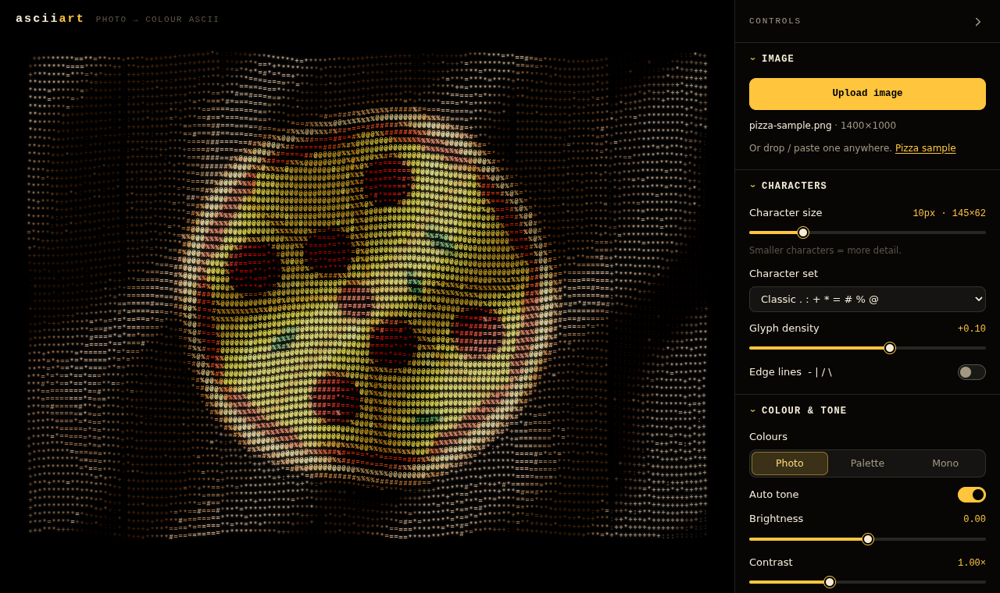

# ascii art

Turn any photo into **animated colour ASCII art** in your browser. Upload (or drop, or paste) a picture, and it's redrawn
as glyphs that ripple like fabric under sweeping bands of light, with bloom, adjustable detail, and AI subject /
background separation. Nothing is uploaded anywhere: your photo never leaves your device.



The colour-ASCII look comes from the animated pizza of
[PizzaDrop](https://github.com/awne8886/p2p-file) (`client/src/ascii/`): the same density ramp (`. : + * = # % @`),
shadow → base → highlight colour ramps per "material", glow baked into the brightest glyphs, rippling rows, diagonal
light bands and sparse flicker. It's generalised from one hand-drawn pizza to any photo, and moved onto the GPU.

## Features

- **Upload anything**: pick a file, drag it onto the page, or paste from the clipboard. JPEG, PNG, WebP, GIF, AVIF, and
  whatever else your browser decodes. Photos are capped at 2048 px internally.
- **Collapsible sidebar** (right side, or a bottom sheet on phones; press **H** to toggle), with:
  - **Characters**: size (smaller = more detail; the grid size is shown live), character set (the original ramp,
    standard, a dense 70-glyph ramp, blocks `░▒▓█`, binary, Matrix-style katakana, or your own characters, which are
    sorted by measured ink automatically), glyph density, and optional **edge lines** (`- | / \` along strong edges).
  - **Colour & tone**: _Photo_ (every glyph keeps its colour), _Palette_ (an adaptive palette of k-means "materials",
    like the pizza's cheese / pepperoni / crust), or _Mono_ (one tint). Auto tone, brightness, contrast, saturation,
    and how much of the photo shows through behind the glyphs.
  - **Wave animation**: on/off, wave on/off, wave height, wavelength, speed, light-band strength, sparkle.
  - **Bloom**: on/off, intensity, radius, threshold, and the baked glyph glow.
  - **Subject & background**: separate the subject automatically, then show
    - **Subject only**: ASCII subject on black, with the original's dim stars,
    - **On photo**: ASCII subject over the untouched photo background (with background brightness and blur),
    - **Inverse**: the photo's subject over an ASCII background,
    - plus _swap subject & background_, and fine-tuning of the cut-out (threshold, edge softness, grow / shrink).
  - **Export**: PNG (2× or 4×), a 6-second video (WebM, or MP4 where that's what the browser records), or the grid as
    plain text.
- Settings persist between visits. With `prefers-reduced-motion`, the animation starts paused (one switch turns it on).

## How it works

```
 photo ─┬─► grid sampler ──► per-cell colour, coverage, edge orientation (structure tensor)
        │                         │
        │                  tone map (Oklab) ─► colour mode (photo / k-means palette / mono)
        │                         │                    │
        │                         └──► shadow · base · highlight ramp, density bias, floor
        │                                              │  16 bytes per cell
        │                                              ▼
        │                                WebGL2: one instanced quad per cell
        │                                vertex shader = the original per-frame loop
        │                                (row ripple, light bands, flicker, colour level, glyph pick)
        │                                              │
        └─► segmentation worker ─► soft mask ─► composite (photo / mask / glyphs) ─► bloom ─► screen
             (U²-Net / BiRefNet / classic,
              refined by a colour-guided filter)
```

- **Sampling** (`src/ascii/analyze.ts`): like the original, the picture is rasterised at a few samples per character
  cell; each cell keeps its alpha-weighted average colour and coverage. A Sobel structure tensor per cell gives the
  dominant edge orientation and how clean it is, for the edge-line glyphs.
- **Tone and colour** (`src/ascii/cells.ts`, `palette.ts`): lightness is auto-levelled in Oklab (measured on the whole
  picture, so the subject looks the same in every composition). Every colour gets a shadow → base → highlight ramp
  derived with constants fitted to the pizza's hand-made materials: shadows darken, desaturate and warm towards red,
  highlights lighten and warm towards yellow. In _Palette_ mode, weighted k-means finds the materials, and small,
  colourful clusters get a brightness floor so they never sink into a dark band (the pizza's pepperoni rule).
- **Rendering** (`src/ascii/renderer.ts`, `shaders.ts`): the pizza renderer blits pre-drawn glyph sprites with
  `drawImage`. Here, every cell is an instanced quad reading a glyph atlas, and the per-frame maths runs in the vertex
  shader, including the same integer hash for the flicker, so hundreds of thousands of glyphs animate at full frame
  rate. Glyphs are drawn offscreen, then a bright-pass + dual-Kawase blur chain produces the bloom, and a final pass
  composites photo, mask and glyphs.
- **Subject separation** (`src/segment/`): runs in a Web Worker so the animation never stutters.
  - **AI · fast**: [U²-Net small](https://huggingface.co/BritishWerewolf/U-2-Netp) (4.6 MB, Apache-2.0), on
    [onnxruntime-web](https://onnxruntime.ai/). Works in every browser.
  - **AI · high quality**: [BiRefNet lite](https://huggingface.co/onnx-community/BiRefNet_lite-ONNX) (MIT), 115 MB
    (fp16) or 224 MB. Needs WebGPU, since at 1024 px it doesn't fit in WebAssembly's memory.
  - **Classic**: no download. It models the background from the colours touching the frame, scores every pixel
    against it with a centre prior, and Otsu-thresholds, keeps the main regions and fills holes. Good for product
    shots and portraits against plain backgrounds.
  - Either way, the coarse mask is refined at 1024 px with a **colour-guided filter**, so its edges snap to the edges in
    the photo. A cut-out PNG with transparency uses its own alpha instead.
  - Models download once from Hugging Face (pinned revisions) and are cached by the browser.

## Development

Requires Node 22.12+.

```sh
npm install
npm run dev        # http://localhost:5173
npm run check      # lint, format check, typecheck, unit tests
npm run build      # static site in dist/
```

## Deploying

It's a static site. `.github/workflows/pages.yml` checks every push and pull request and publishes `main` to
**GitHub Pages**. One-time setup: _Settings → Pages → Build and deployment → Source: GitHub Actions_. Any other static
host works too: `npm run build` and upload `dist/` (set `BASE_PATH` if it's served under a sub-path).

## Licence

MIT. The segmentation models keep their own licences (Apache-2.0 and MIT, above).
